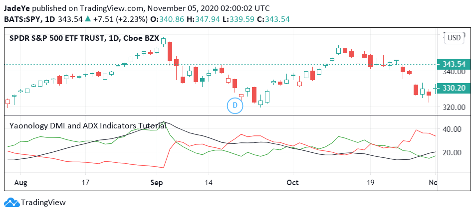
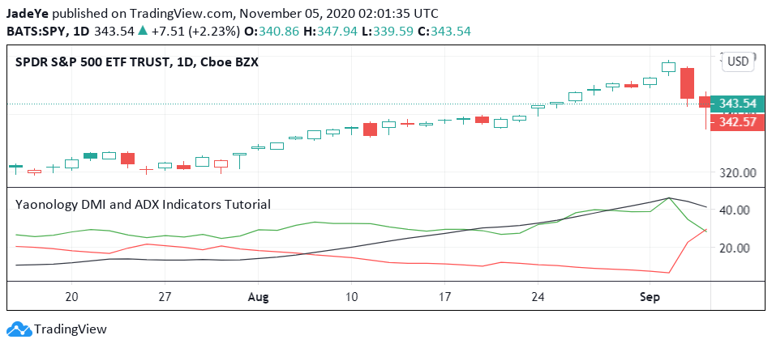
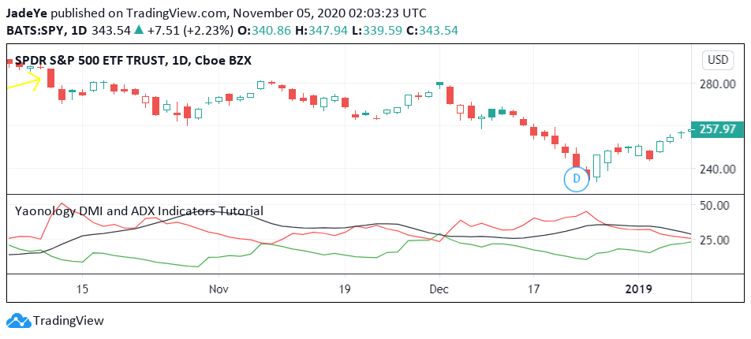
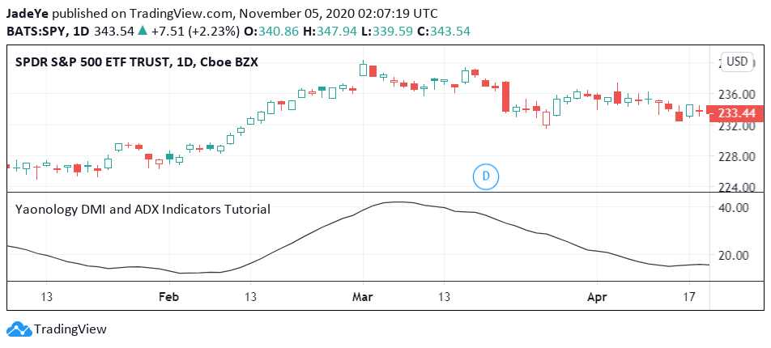

# DMI and ADX

## 1. What is the DMI and ADX?

The indicator is made up for three lines.

+DMI :It is the sum of the +DM(the Positive Directional Indicator) in recent 7 days.+DM represents the positive trend value, that is, the upward trend value, its value is equal to the highest price of the day minus the highest price of the previous day.

-DMI :It is the sum of the -DM(the Negative Directional Indicator) in the recent 7 days.﹣DM stands for negative trend change value, that is, downward trend value, its value is equal to the lowest price of the previous day minus the lowest price of the day.

ADX :The average directional index (ADX) is a technical analysis indicator used by some traders to determine the strength of a trend. The trend can be either up or down and can help assess whether a trade should be taken long or short.



## 2. What does the DMI and ADX tell you? 

### · +DMI/-DMI Bull/Bear Trend

#### Bull Trend when +DMI > -DMI

If the +DMI is larger than the -DMI, the trend will be upward and means that the buying power in the market is released. Therefore, it is going to be a bull market.



#### Bear Trend when -DMI > +DMI

If the -DMI is larger than the +DMI, the trend will be downward and is going to be a bear market.



### · ADX Trend Strength

The ADX is the simple moving average of the DX in the period. The DX can be calculated as the difference between +DI and -DI divide the sum of these two values.

If the ADX is larger than 15 and is increasing, it shows a strong trend.

If it is smaller than 15, it shows no trend.
(Normally, the guide recommends using ADX as 25, but we use ADX as 15 because the SPY trend strength is relatively smaller in the bull market.)

When the ADX turns down from high values, then the trend may be ending.



## 3.  Relative DMI and ADX Strategy

### · DMI Strategy

The first strategy is based on DMI.

If the +DMI is larger than the -DMI, which is a bull market trend, we should buy. 

If the +DMI is smaller than the -DMI, that is a bear market trend, then we should sell.

### · ADX and DMI Strategy

The second strategy combines ADX and DMI.

If the +DMI is larger than -DMI,  the ADX is larger than 15 and the current ADX is larger than the ADX in the previous day, we should buy.

If the +DMI is smaller than -DMI, we should sell since it indicates a downward trend.

## 4. Tradingview Pine Script

### · Step One: Initial Setting

(1) Step one initial setting is the step we set up the strategy property, which includes “Strategy ID”, “The plot overlays the main chart or show on the separate chart pane. ”, “How much is the initial capital”, “How many percentages of capital buying the equity?”, “How much is commission fee”

(2) First, we need to set up the Pine Script version. Here, we are using the last version, version four.

(3) Then, we start to code the strategy property. The double quote we type “Yaonology DMI and ADX Indicators Tutorial”, which is the strategy id.

(4) “overlay equals true” means that the plot overlays the main chart. On the other hand, if “overlay equals false”, it means that the plot will show on the separate chart pane.

(5) Then, we set up the initial capital, here, we code “initial_capital equals 10000” and “currency = currency.USD”, which means that we are using US$10000 as the initial capital

(6) Then, we need to determine how many shares we trade equities. Here, we code “default_qty_type equals strategy.percent_of_equity” and “default_qty_value equals a hundred”, which means that we are using the percentage type to trade the equity, and we use 100 percent of capital to trade the equities.

(7) Finally, we set up the commission fee. Here, we code “commision_type equals strategy.commission.percent” and “commission_value = 0”, which means that we use the percentage type to calculate the commission fee, and here we set up 0% commission fee because most brokers don’t charge the commission fee currently.

```
//@version = 4
//Step One: Initial Setting
strategy("Yaonology DMI and ADX Indicators Tutorial", overlay=false, default_qty_type = strategy.percent_of_equity, default_qty_value = 100, currency = currency.USD, initial_capital = 10000, commission_type = strategy.commission.percent, commission_value = 0)
```

### · Step Two: Parameter Setting
(1) Step Two Parameter Setting is the step we set up the parameter. 

(2) The dmi function returns the directional movement index. 

(3)The “diplus” means the positive directional movement (+DI), the “diminus” means the negative directional movement (-DI) and the “adx” means the average directional movement index (ADX)

(4) Here, we set the period length for diplus and diminus as 14, and the period length for adx as 14 as well. 

(5)Therefore, “diplus” means the positive directional movement within the 14 days.

“diminus” means  the negative directional movement within the 14 days.

“adx” means the average directional movement index within the 14 days.

```
//Step Two: Parameter Setting
[diplus,diminus,adx] = dmi(14,14)
```

### · Step Three: Plotting
(1) Step Three Plot is the step that we plot the three lines on the main chart series.

(2) The plot function can plot a series of data on the chart.“Color equals color.green” means that we plot “diplus” as a green color. And we plot the dimius as red and adx as black.

```
//Step Three: Plotting
plot(diplus, color = color.green)
plot(diminus, color = color.red)
plot(adx, color = color.black)
```

### · Step Four: Strategy Entry and Strategy Close

#### DMI Strategy
(1) Step Four Strategy Entry and Strategy Close is the step that we set up a condition to buy equity and sell the equity.

(2) Script “If” is the function of what block of statements must be executed when conditions of the expression are satisfied. Here, the statement is “crossover(diplus,dimius)”, which means the diplus crossed over dimus

(3) If the statement is true, the script will execute the next line strategy.entry

(4) “Strategy entry” is the command to enter a market position. How many capitals and how much percentage we have set in Step One. Here, we need to give it an id to identify the entry order, and we give it “dmi”. “Long equals true” means that this order is a long position.

(5) A long position means that the purchase of an asset with the expectation it will increase in value.

(6) On the other hand, “Long equals false” means that the order will become a short position that means the purchase of an asset with the expectation it will decrease in value.

(7) Then, we set up the close order. We also give the “if” statement “crossunder (diplus,dimius)””, which means that the diplus crossed under dimius

(8) If the statement is true, it will execute the next line strategy.close

(9) “Strategy.close” is the function that a command to exit from the entry with the specified ID. Here, we want to need to close the order, which id is “dmi”

```
//Step Four: Strategy Entry and Strategy Close
//DMI Strategy
if crossover(diplus, diminus)
  strategy.entry("dmi", long = true)
  
if crossunder(diplus, diminus)
  strategy.close("dmi")
```
(10)  Here, we click the “Add to chart” to run the backtesting report.

(11) The net profit is positive 191.69%, which means that this DMIstrategy can make a profit. 

|  | **Net Profit** | **Precent Profitable** | **Profit Factor** | **Max Drawdown** | 
| --- | --- | ---| --- | --- |
| **DMI Strategy** | 191.69% | 38.63% | 1.547 | 21.32% |

#### ADX and DMI Strategy

(1) If we want to use the close price above/below the 35-day Simple moving average, we simply change the “if” statement as “diplus>diminus and adx larger than 15 and adx is larger than the previous adx”, strategy.entry.

(2) Then, “if” statement as “diplus smaller than diminus”, strategy.close.

```
//Step Four: Strategy Entry and Strategy Close
//ADX and DMI Strategy
if diplus > diminus and adx > 15 and adx > adx[1]
  strategy.entry("dmi", long = true)

if diplus < diminus
  strategy.close("dmi")
```
(3) We click the “Add to chart” to run the backtesting report.

(4) The net profit is 88.02%, which is much smaller than the DMI Strategy.But the Max Drawdown is 12.79%, which is much lower than DMI Strategy.

(5) Therefore, the DMI Strategy can make higher profit than ADX and DMI Strategy but have higher risk.

|  | **Net Profit** | **Precent Profitable** | **Profit Factor** | **Max Drawdown** | 
| --- | --- | ---| --- | --- |
| **DMI Strategy** | 191.69% | 38.63% | 1.547 | 21.32% |
| **ADX and DMI Strategy** | 88.02% | 42.19% | 1.547 | 12.79% |
